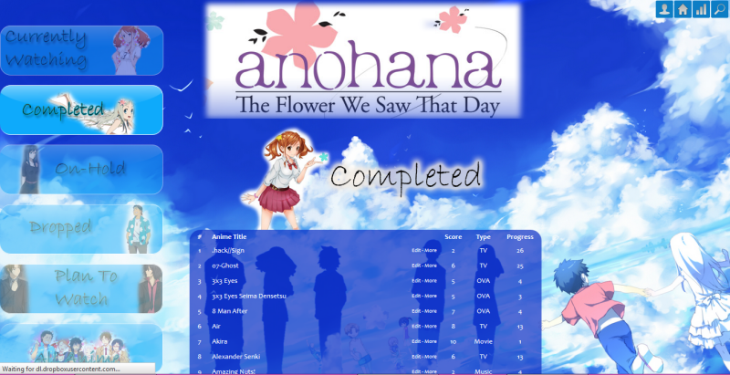

# Anohana

## Info

You can mark your faves with custom color text and a flower marking (you can change the flower if you want too). Notes on how to are in the CSS, scroll down to FAVORITE MARKINGS or FAVORITE TITLES TEXT COLOR. If you still have trouble with it you can ask in this topic.

One of my favorite animes Death Note is marked with a flower and gold text. Its easy to set all your faves this way!

**Links:**
- [Forum](https://myanimelist.net/forum/?topicid=607931)
- [Forum](https://myanimelist.net/forum/?topicid=618961)

## Warnings

Favourite anime image is tinypic and thus broken.